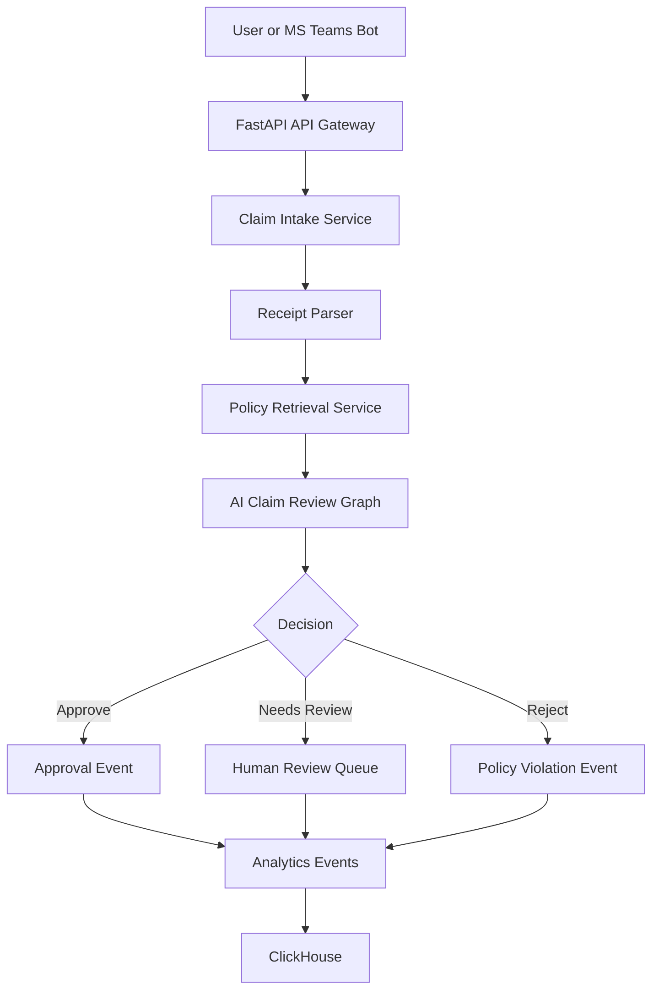

# AI Travel & Expense Copilot

A production-style backend project that demonstrates how to build an AI-powered Travel & Expense automation platform using FastAPI, agent orchestration, policy-aware RAG, receipt extraction, workflow approvals, and analytics-ready event design.

This repository is designed for a strong GitHub portfolio impression: it shows clean architecture, API design, AI workflow orchestration, testable business logic, Docker support, CI, and cloud deployment thinking.

## Why this project matters

Enterprise Travel & Expense systems need more than CRUD APIs. They need policy validation, document intelligence, approval workflows, audit trails, analytics, and assistant-style user experiences. This project simulates that complete backend layer.

## Features

- AI claim review workflow using a graph-based orchestration pattern
- Travel and expense policy validation using lightweight RAG-style retrieval
- Receipt text extraction and structured claim generation
- Approval recommendation engine with explainable decision output
- REST APIs built with FastAPI
- Event-driven architecture examples for approval and audit events
- ClickHouse-ready analytics schema and sample event ingestion model
- Docker Compose setup with optional ClickHouse service
- GitHub Actions CI workflow
- Unit tests for policy retrieval and claim review logic
- Clean project structure suitable for real production services

## Tech Stack

- Python 3.11+
- FastAPI
- Pydantic
- Uvicorn
- Pytest
- Docker
- ClickHouse-ready SQL design
- LangGraph-inspired agent workflow pattern

## Architecture



## Repository Structure

```text
ai-travel-expense-copilot/
├── src/expense_ai_copilot/
│   ├── api/                 # API route handlers
│   ├── agents/              # Claim review orchestration graph
│   ├── core/                # Settings and common utilities
│   └── services/            # Receipt, policy, review, and analytics services
├── sample_data/             # Demo policies, receipts, and events
├── tests/                   # Unit tests
├── docs/                    # Architecture and API docs
├── infra/                   # Deployment and analytics examples
├── docker-compose.yml
├── Dockerfile
├── pyproject.toml
└── README.md
```

## Quick Start

```bash
python -m venv .venv
source .venv/bin/activate
pip install -e '.[dev]'
uvicorn expense_ai_copilot.main:app --reload
```

Open API docs:

```text
http://localhost:8000/docs
```

## Docker Run

```bash
docker compose up --build
```

## Example API Request

```bash
curl -X POST http://localhost:8000/api/v1/claims/review \
  -H 'Content-Type: application/json' \
  -d '{
    "employee_id": "EMP-1001",
    "employee_grade": "L4",
    "expense_type": "hotel",
    "city": "Mumbai",
    "amount": 4200,
    "currency": "INR",
    "receipt_text": "Hotel stay Mumbai. Room charge INR 4200. GST included."
  }'
```

## Example Response

```json
{
  "decision": "approved",
  "risk_score": 0.12,
  "policy_references": [
    "Domestic hotel reimbursement for L4 employees is allowed up to INR 5000 per night in metro cities."
  ],
  "reasons": [
    "Amount is within allowed hotel limit for employee grade and city tier.",
    "Receipt text contains hotel stay evidence."
  ],
  "next_action": "create_approval_event"
}
```

## Portfolio Talking Points

Use these in your GitHub README, LinkedIn, or interviews:

- Designed a graph-based AI workflow for enterprise expense claim review.
- Implemented RAG-style policy retrieval without external dependencies for local demo reliability.
- Modeled event-driven approval and audit flows for cloud-native systems.
- Added ClickHouse-ready analytics schema for real-time claim and policy violation reporting.
- Built a production-style FastAPI backend with tests, Docker, and CI.

## Roadmap

- Add real embedding model support with OpenAI, Bedrock, or local sentence-transformers
- Add LangGraph implementation with persistence checkpointing
- Add OCR integration for PDF/image receipts
- Add AWS Lambda + API Gateway deployment template
- Add MS Teams approval bot integration
- Add ClickHouse dashboard queries

## License

MIT
